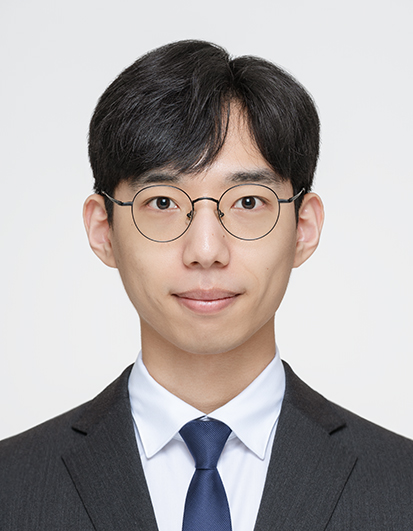

:::: {.columns .home-hero}
::: {.column width="36%"}
{.home-profile-image}
:::

::: {.column width="64%"}
## Kunwoo Park

::: {.home-meta}
PhD Student

Department of Electrical and Computer Engineering

Seoul National University

Supervisor: [Sunkyu Yu](https://waves.snu.ac.kr)
:::
:::
::::

::: {.home-intro}
I conduct theoretical and experimental research in photonics and related fields, aiming to realize ***AI computing with light***.
:::

::: {.about-links}
<a href="mailto:imotdnif43@snu.ac.kr" class="about-link"><i class="bi bi-envelope"></i> Email</a>
<a href="https://github.com/KunwooPark" class="about-link"><i class="bi bi-github"></i> GitHub</a>
<a href="https://www.linkedin.com/in/kunwoo-park-38ba13329/" class="about-link"><i class="bi bi-linkedin"></i> LinkedIn</a>
<a href="https://scholar.google.com/citations?user=KrNjLQgAAAAJ" class="about-link"><i class="bi bi-mortarboard"></i> Google Scholar</a>
:::
